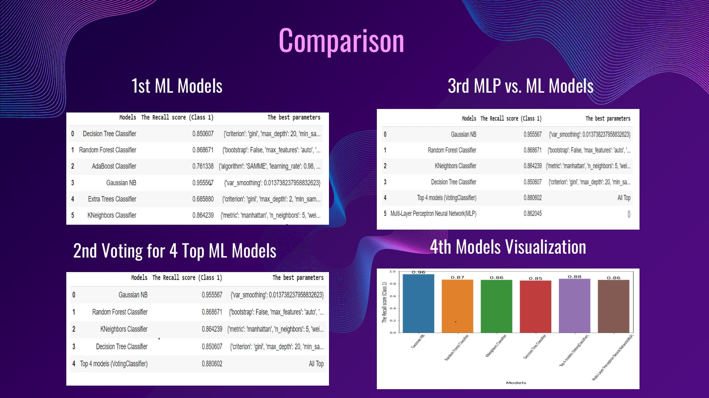

# Detecting malicious Website Using its URL

## PROBLEM DEFINITION:

Nowadays internet is a critical life need like food and water and we cannot imagine our life without the internet because our all knowledge, activities, works, memories, history, and lifestyles are the main components of the internet so we must secure it to avoid the destruction for our life. One of the main challenges in internet security is malicious websites because we cannot identify whether they are malicious or not without logging into them, so in our project, we will work on detecting malicious websites via their URLs.

## DATASET

This dataset contains 651,191 URLs, out of which 428103 benign or safe URLs, 96457 defacement URLs, 94111 phishing URLs, and 32520 malware URLs. 
The link: https://www.kaggle.com/datasets/sid321axn/malicious-urls-dataset

 

## Deployment and Demo as shown in the following video:

<video src="./Recrord.mp4" controls="controls" style="max-width: 730px;">
</video>

